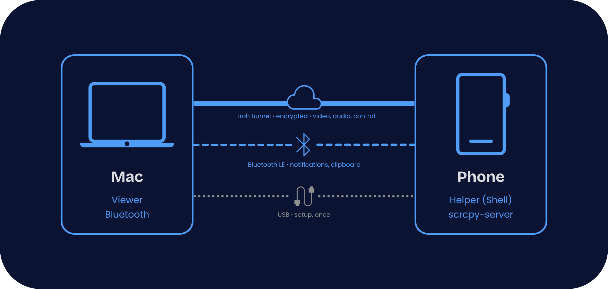
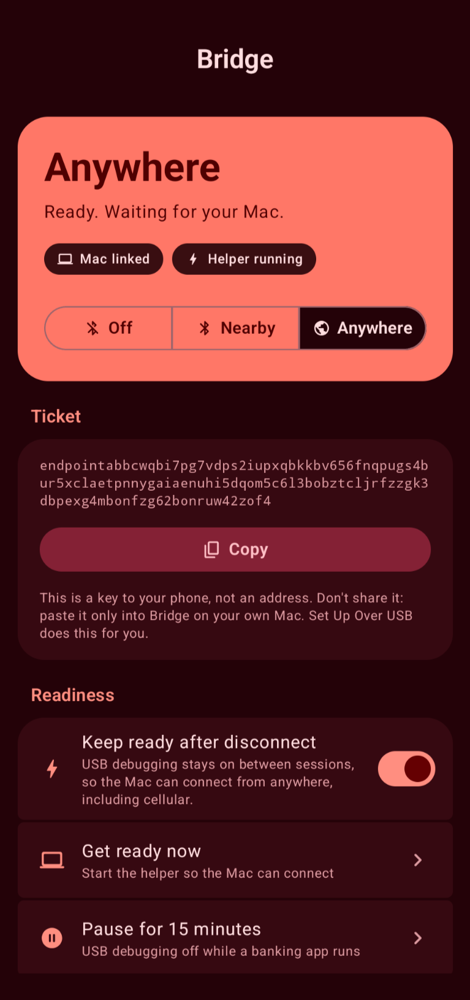
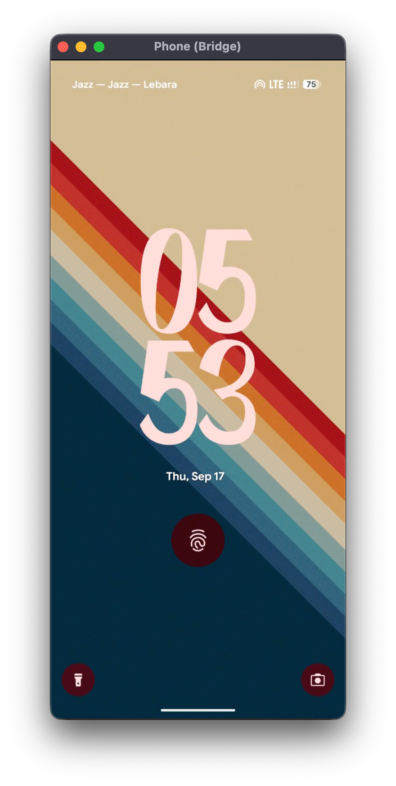
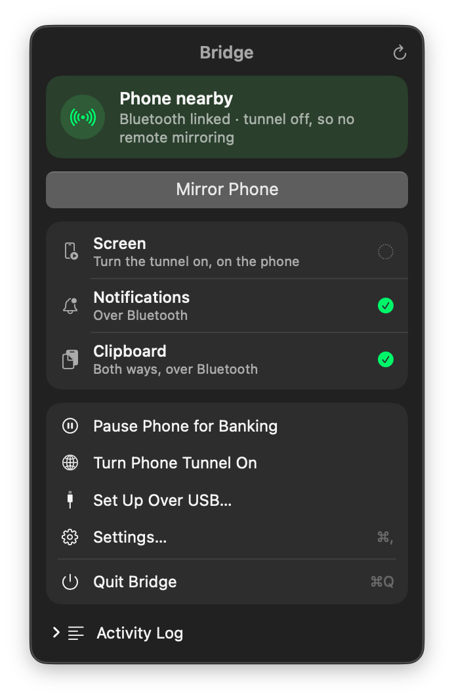
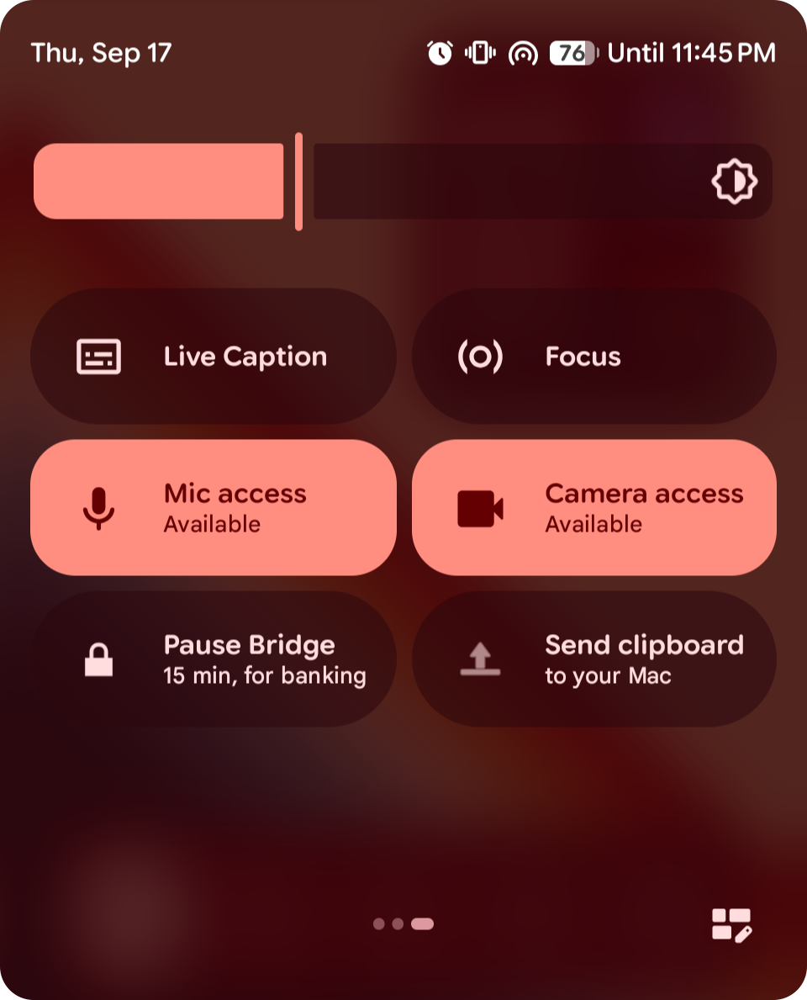

<p align="center">
  
</p>

# Bridge

<p align="center">
  <b>Your Android phone, on your Mac or PC, from anywhere</b>
</p>
<p align="center">
  See and control your phone over any network, with shared clipboard and notifications.
</p>

<div align="center">

  
  
  

</div>

<br>

## &nbsp; The Problem
Remote-controlling a phone you own is strangely hard. The tools exist, but each one attempts to solve a single problem.

<table width="100%">
  <tr>
    <td width="33%" valign="top" align="center">
      <br>
      <h3 align="center">&nbsp; Tethering</h3>
      <p align="center">scrcpy is excellent, but it needs a cable or the same Wi-Fi, and a port that changes on every reboot.</p>
      <br>
    </td>
    <td width="33%" valign="top" align="center">
      <br>
      <h3 align="center">&nbsp; Lock Screen</h3>
      <p align="center">Normal screen mirroring apps can't show the lock screen. Android 14+ stops capture the moment the phone locks, so you can't unlock it from afar.</p>
      <br>
    </td>
    <td width="33%" valign="top" align="center">
      <br>
      <h3 align="center">&nbsp; Banking Apps</h3>
      <p align="center">Banking apps refuse to run while USB debugging is on. "Just leave adb enabled" is not an option on a real phone.</p>
      <br>
    </td>
  </tr>
</table>

<br>

## &nbsp; The Solution
Bridge treats it as a **connectivity and privilege problem**, rather than a screen-sharing problem. Each phone has a permanent key; the computer dials that key over [iroh](https://iroh.computer) (direct when possible, encrypted relay when not). The phone grants itself shell privileges through a one-second wireless-debugging window on localhost, runs scrcpy's capture code, and forwards the streams to a native viewer on the Mac or PC.

### How it works
<p align="center">
  
</p>

1.  **Tunnel:** The phone keeps an outbound iroh connection open (bundled `dumbpipe`, foreground service). Works on cellular and with VPNs on both ends.
2.  **Wake:** The computer sends `START` via Bluetooth. The phone turns USB debugging on, opens wireless debugging on a random localhost port for about a second, and connects to its own adbd with its own already-trusted key. No pairing code, no computer.
3.  **Daemon:** Over that connection it spawns a shell-uid helper with `app_process`, then closes the window. The helper launches scrcpy's server and relays its video, audio and control sockets.
4.  **Session:** The Mac decodes H.264 with `AVSampleBufferDisplayLayer` and AAC with AudioToolbox; Windows uses Media Foundation and WASAPI. Both turn mouse and keyboard into scrcpy control messages. Bitrate adapts to the link strength.
5.  **Lock down:** Disconnect turns USB debugging off again. Or keeps it ready for cellular and pauses it from a Quick Settings tile when a banking app complains.

> Some banking apps look for Developer Options instead of USB Debugging, for which you can disable Developer Options after the setup is complete (At least after using Wifi to connect once and "Keep Ready" on for cellular).

<br>

## &nbsp; Security Model

| **When**                  | **What's reachable**                                                                                       |
| :------------------------ | :--------------------------------------------------------------------------------------------------------- |
| **Idle (default)**        | USB debugging off. Nothing from Bridge but the outbound tunnel. Banking apps see a normal phone.           |
| **Bootstrap (~1 s)**      | Wireless debugging on a random port, only on Wi-Fi networks you approved, gated by adbd's key check.       |
| **During a session**      | No ADB listener on any interface. adbd is USB-only; the daemon and proxy bind to loopback.                 |
| **Over the internet**     | Only someone holding the ticket *and* the pairing secret. End-to-end encrypted QUIC; relays forward ciphertext. |
| **On the phone itself**   | Other apps can reach the loopback ports, but every connection must open with the pairing secret or is refused. |
| **Over Bluetooth**        | The link is verified with an HMAC challenge in both directions before anything is sent. The Mac uses a bonded, link-encrypted channel; Windows uses an unbonded one with AES-GCM on top, keyed from the pairing secret and both handshake nonces. |
| **On the computer**       | Ticket and secret live in the Keychain on the Mac and under DPAPI on Windows. Another local process that finds the tunnel port has no secret and gets `ERR unauthorized`. |

**The pairing secret** is 32 random bytes the phone generates once. The computer learns it over USB (Set Up Over USB) or as the second word of a copied ticket. "New identity" on the phone rotates it along with the ticket. A phone updated from a build without it needs one Set Up Over USB.

<br>

## &nbsp; Tech Stack
Jetpack Compose on the phone, SwiftUI on the Mac, Rust and Slint on Windows, and two carefully chosen binaries doing the heavy lifting. No networking or protocol libraries: the ADB client, the scrcpy protocol and the H.264/AAC handling are all written here.

| **Component**        | **Technology**                                                                                                | **Description**                                                                            |
| :------------------- | :------------------------------------------------------------------------------------------------------------ | :----------------------------------------------------------------------------------------- |
| **Phone app**        |                        | Kotlin and Compose (Material 3). Foreground service, in-app ADB client (RSA + TLS), Wi-Fi bootstrap. |
| **Mac app**          |                                        | Swift Package: SwiftUI menu bar, AppKit viewer, AVFoundation and AudioToolbox decoding.    |
| **Windows app**      |                                       | Rust: Slint UI (Material 3), WinRT Bluetooth LE, Media Foundation video, WASAPI audio, tray icon. Built by GitHub Actions. |
| **Connectivity**     |                                               | [iroh](https://github.com/n0-computer/iroh) via `dumbpipe`: QUIC, hole punching, relay fallback. |
| **Capture & input**  |  | [scrcpy](https://github.com/Genymobile/scrcpy)'s server, bundled as-is, run by our shell-uid daemon. |
| **ADB client**       |         | Adapted from [Shizuku](https://github.com/RikkaApps/Shizuku); talks to the phone's own adbd over loopback. |

<br>

## &nbsp; Visuals

| Phone app | Phone window |
| :---: | :---: |
|  |  |
| **Mac menu** | **Quick Settings tile** |
|  |  |

<br>

## &nbsp; Getting Started

### Install a release

1. **Phone:** download `app-release.apk` from [Releases](https://github.com/Bonevane/Bridge/releases) and open it (allow installs from your browser when asked). Requires Android 11+ and an arm64 phone, i.e. anything from the last several years.
2. **Mac:** download `Bridge-<version>.dmg`, open it and drag Bridge onto Applications. Everything it needs is inside the bundle.
   **Windows:** download `Bridge-<version>-windows.zip` and unzip it anywhere. Keep the five files together.
3. **Pair, once:** on the phone after allowing all permissions, enable Developer options → USB debugging. Plug in, click **Set Up Over USB** (Bridge's menu on the Mac; Actions or Settings → Pairing on Windows), accept "Allow USB debugging" on the phone with *Always allow*. Unplug. **Mirror Phone.** The first time on each Wi-Fi network Android asks "Allow wireless debugging on this network?"; tick *Always allow*.

macOS will ask for Bluetooth and Notifications the first time; both are needed for the short-range link. On the Mac, Bluetooth pairs the phone in the usual way; Windows needs no Bluetooth pairing at all. A Mac and a PC can both be linked to the phone at the same time.

You can turn Developer options off again after setup. Bridge switches USB debugging itself, but **do it on Wi-Fi**: it also turns USB debugging off, and Bridge can only restart its helper through wireless debugging, which Android offers on Wi-Fi only. Once the helper is back (a few seconds), cellular works again. Do it on LTE and you're stuck until the phone next sees Wi-Fi (or you reconnect via a cable).

### Build from source

```bash
brew install dumbpipe && brew install --cask android-platform-tools
```

**Phone**
```bash
cd android && ./scripts/fetch-dumbpipe.sh && ./scripts/fetch-scrcpy-server.sh
echo "sdk.dir=$HOME/Library/Android/sdk" > local.properties
./gradlew installDebug
```

**Mac**
```bash
cd mac && ./make-app.sh && open build/Bridge.app
```
`make-app.sh` bundles `dumbpipe` and `adb` from Homebrew and signs ad-hoc; pass `SIGN_ID="<certificate name>"` to sign with a certificate from Keychain Access so macOS keeps the app's permissions between builds. `./release.sh` produces the DMG.

**Windows**
```bash
cd windows && cargo build --release
```
Put `dumbpipe.exe` and platform-tools' `adb.exe`, `AdbWinApi.dll` and `AdbWinUsbApi.dll` next to `Bridge.exe`. The [Windows workflow](.github/workflows/windows.yml) does this and uploads the result as an artifact on every push.

Then pair as in step 3 above.

Shortcuts in the phone window: ⌘B back · ⌘H home · ⌘R recents · ⌘N notifications · ⌘P power · ⌘O screen off · right-click back (Ctrl instead of ⌘ on Windows).

<br>

## &nbsp; Roadmap
- [x] **Tunnel:** iroh connection with a permanent identity; works on cellular and through VPNs
- [x] **Remote wake:** phone turns USB debugging on and starts its own privileged daemon on request
- [x] **Reboot without cable:** Wi-Fi bootstrap via mDNS + TLS, no pairing
- [x] **adb-free sessions:** native viewer, no ADB port on the network while mirroring
- [x] **Audio:** AAC stream, optional mute of the phone's own speaker
- [x] **Adaptive bitrate:** steps down on a slow link, back up when it clears
- [x] **Banking mode:** lock down by default, or keep ready with a Quick Settings pause tile
- [x] **Self-update:** new builds installed through the tunnel, no cable
- [x] **Clipboard sync** both ways, during a session or in the background
- [x] **File drop:** drag files onto the phone window
- [x] **Notification mirroring:** works even with USB debugging off
- [x] **Bluetooth link:** notifications and clipboard travel over BLE when the phone is nearby, so no tunnel has to stay open
- [x] **Native interfaces:** Material 3 Expressive on the phone, a proper menu and Settings window on the Mac, Material 3 on Windows
- [x] **Windows client:** the same features in Rust; a Mac and a PC can be linked at once
- [x] **Notification icons:** the phone's app icons on Mac and Windows notifications
- [ ] **Auto-pause** when a listed app comes to the foreground
- [ ] **Files over Bluetooth** as well as the tunnel
- [ ] **Device pairing:** approve new computers on the phone instead of a bearer ticket
- [ ] **iroh in-app:** replace the dumbpipe binary with the library; self-hosted relay
- [ ] **Linux client**

<br>

## &nbsp; Acknowledgements
- [scrcpy](https://github.com/Genymobile/scrcpy): the server does the real work on the phone
- [iroh](https://github.com/n0-computer/iroh) and [dumbpipe](https://github.com/n0-computer/dumbpipe): connectivity that just works
- [Shizuku](https://github.com/RikkaApps/Shizuku): the in-app ADB client is adapted from theirs
- [thedjchi's Shizuku fork](https://github.com/thedjchi/Shizuku/wiki): for the TCP-mode-and-intents trick that unlocked the banking-app problem
- [awesome-readme](https://github.com/matiassingers/awesome-readme#readme): for listing this README among its examples [](https://github.com/matiassingers/awesome-readme#readme)

Bridge is released under the [Apache License 2.0](LICENSE). See `NOTICE` for the licences of the parts it builds on.

<br>

<div align="center">

[](https://github.com/bonevane)
[](https://bonevane.vercel.app)
[](mailto:rahmad.atomic44@gmail.com)

</div>

<p align="center">
  <sub>Made with &nbsp;<sub></sub>&nbsp; by Bonevane</sub>
</p>
